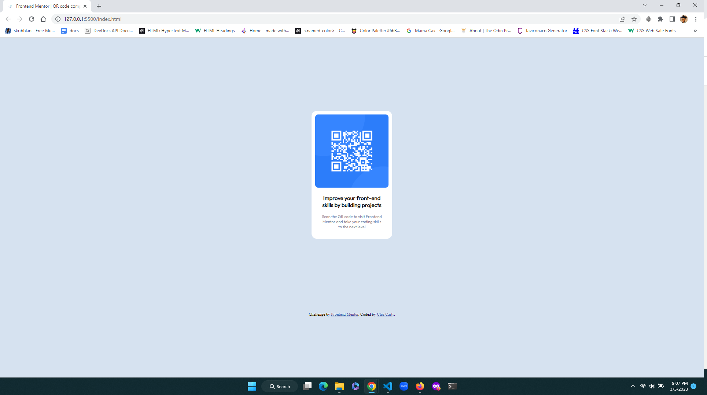

# Frontend Mentor - QR code component solution

This is a solution to the [QR code component challenge on Frontend Mentor](https://www.frontendmentor.io/challenges/qr-code-component-iux_sIO_H). Frontend Mentor challenges help you improve your coding skills by building realistic projects.

## Table of contents

- [Overview](#overview)
  - [Screenshot](#screenshot)
  - [Links](#links)
  - [Built with](#built-with)
  - [What I learned](#what-i-learned)
  - [Continued development](#continued-development)
  - [Useful resources](#useful-resources)
- [Author](#author)
- [Acknowledgments](#acknowledgments)

## Overview

### Screenshot



### Links

- [Solution URL](https://github.com/CNash23/2nd-pro/blob/main/index.html)
- [Live Site URL](https://cnash23.github.io/2nd-pro/)

### Built with

- Basic HTML
- Basic CSS

### What I learned

I learned:

- How to space using margins
- How to shape corners using the 'border-radius' property
- How to center align text
- How to style the font family using google fonts

```css
.this-property-was-fun {
  border-radius: 15px;
}
```

### Continued development

As a beginner, I would like to deepen my knowledge of HTML, CSS, Javascript as a short term goal, and subsequently lear other programming languages that would be useful for a
career in web development.

### Useful resources

- [Resource 1](https://fonts.google.com/specimen/Outfit) - This helped me style my text to the project specifications. I will be using this resource again in the future
- [Resource 2](https://www.w3schools.com/css/css3_borders.asp) - This resource explained how to use the border-radius property to round corners of my div and image.

## Author

- Website - Clea Carty(https://www.linkedin.com/in/clea-carty-50930a26/)
- Frontend Mentor - [@CNash23](https://www.frontendmentor.io/profile/CNash23)
